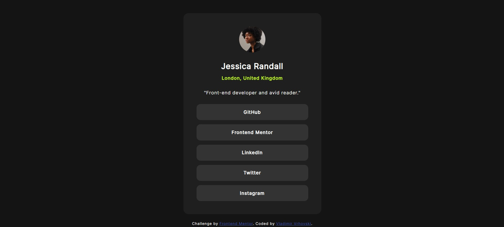

# Frontend Mentor - Social links profile solution

This is a solution to the [Social links profile challenge on Frontend Mentor](https://www.frontendmentor.io/challenges/social-links-profile-UG32l9m6dQ).

## Table of contents

- [Overview](#overview)
  - [The challenge](#the-challenge)
  - [Screenshot](#screenshot)
  - [Links](#links)
- [My process](#my-process)
  - [Built with](#built-with)
  - [What I learned](#what-i-learned)
  - [Continued development](#continued-development)
  - [Useful resources](#useful-resources)
- [Author](#author)
- [Acknowledgments](#acknowledgments)

## Overview

### The challenge

Users should be able to:

- See hover and focus states for all interactive elements on the page

### Screenshot



### Links

- Solution URL: [Add solution URL here](https://github.com/VladimirVrhovski/social-links-profile-main)
- Live Site URL: [Add live site URL here](https://vladimirvrhovski.github.io/social-links-profile-main/)

## My process

### Built with

- Semantic HTML5 markup
- CSS custom properties
- Flexbox
- CSS Grid
- Mobile-first workflow

### What I learned

I'm proud of myself for noticing that the line-height and letter-spacing weren't default values and needed to be tweeked.

```css
body {
	line-height: 1.5;
	letter-spacing: 1px;
}
```

## Author

- Frontend Mentor - [@VladimirVrhovski](https://www.frontendmentor.io/profile/VladimirVrhovski)
- Instagram - [@dovla7\_](https://www.instagram.com/dovla7_)
- UpWork - [Vladimir Vrhovski](https://www.upwork.com/freelancers/~012c647015861fb26b?mp_source=share)
